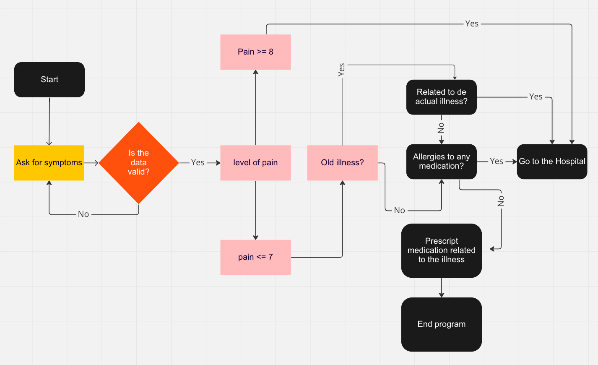

# Doctor_Online

Medical consultationis a Online App built with Python language that runs on Heroku.

The following program it is builded to be an Online medical consultation. 

The main gol of this app is to give to the patient some medication to solve a temporary pain or discomfort. 
By doing this it’s possible to avoid long queues on the hospitals and allow to solve minor problems for someone in need of it. 

In the next few lines I’ll explain the functionality of the program: 

1 The program will have an Wellcome message and will ask the following questions: Name, document ID and Gender.

2 After collecting all the data needed the program will pop up a warning message remembering the patient to
 be 100% honest once the answers are essential for the success of the consultation.

 3 The patient chose one symptom, if the patient chose more than three the data is invalid 
and is requested to answer again.

4 On this stage is asked the Level of pain, if the level of pain is superior to eight in a scale of one to ten an alert 
of medical emergency will be activated and the patient is highly recommended to  go to the hospital ASAP!
If the level of pain is inferior to 7 the the consultation moves on.

5 In this stage the patient is questioned about old illnesses, if the question is affirmative then the patient must go to the hospital. 
The reason is that other treatments may be necessary or a specific type of medication. If the answer is no then the patient moves 
one to the next question.

6  Fourth question is about any allergies that the patient could have, if the answer is positive than the patient should go to 
an hospital to pass thru a detailed examination and avoid major problems. If the answer is no then the program will
prescribe the proper medication according to the age , gender and type of symptoms. 

## Credits
For the medicine used for every symptom I have cheked on this website:
https://www.medindia.net/
For the sypmtom list I used this website:
https://medlineplus.gov/symptoms.html
for Help with the code I used:
https://learn.codeinstitute.net/
